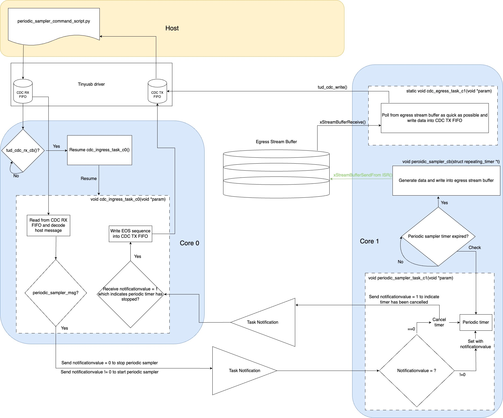

# Raspberry Pi Pico W Stream-based Egress Interface with TinyUSB (Multi-core)

This C project investigates the performance of a stream-based data egress interface on the Raspberry Pi Pico W, with it being set up as a CDC (Communication Device Class) USB device to communicate with a host (such as a laptop) using TinyUSB as the usb stack and nanopb for encoding/decoding host-to-device and device-to-host messages. Under normal configuration, the exchange of information is done via a message-based protocol between the device and host. However, during high speed data acquisition, the device is switched to a stream-based protocol to stream data back to the host as quick as possible. This project aims to measure the throughput of the stream-based egress interface data egress interface with the device operating on FreeRTOS. A CLI interface has been developed for the host to communicate with the device through different commands.

## Description
With the introduction of the Python CLI host interface (accessible via the entry point `python_host_scripts/periodic_sampler_command_script.py`), users can explore system bottlenecks by adjusting the sampling period of the periodic sampler on the Pico W through the CLI.

Once the user establishes a connection to the device and configures a periodic sampler using the CLI, the host transitions into streaming mode to receive data streamed from the device.

On the device, a recurring timer on core 1 is initiated. Upon timer expiration, a callback is triggered, generating data that is then placed into a FreeRTOS stream buffer. A task on core 1 retrieves data from this stream buffer and promptly relays it back to the host via the TinyUSB CDC stack. Throughout this streaming operation, the device actively monitors user commands, allowing interruptions to the operation and a switch back to message mode when needed.

The following diagram shows the interaction between host, core 0 and core 1.



Core 0 on the RP2040 is responsible for communication with the host, and fetching nanopb messages from a FreeRTOS message buffer when messages are available to be sent across to the host. On the other hand, a repeating timer is set up on Core 1, it is responsible for generating data and put them into the FreeRTOS stream buffer when the timer expires. The period of the timer can be changed dynamically using the python host interface (see `python_host_script/README.md` for commands to communicate with the device). The upper limit of the sampling frequency is 25kHz (equivalent to a minimum sampling period of 40 micro-seconds) with the TinyUSB + FreeRTOS architecture.

To facilitate testing, the device C code incorporates built-in assertions to guarantee the absence of dropped bytes. In cases where byte drops occur due to system inefficiencies—particularly evident when employing a short sampling period for the periodic sampler—the device triggers assertion failures and initiates an automatic shutdown. To restart, users must unplug and replug the power cable into the Pico W.

During testing, it became evident that for sampling periods smaller than 40 micro-seconds, the current architecture results in assertion failures, highlighting the need for optimisation in subsequent iterations.

## Technology utilised
### Device
#### Hardware features
- [x] Hardware timer interrupts

#### Libraries
- [x] pico-sdk
- [x] FreeRTOS
- [ ] lwIP
- [x] TinyUSB
- [x] nanopb

#### FreeRTOS features
- [ ] Software timers
- [ ] Queues
- [ ] Semaphore/Mutexes
- [x] Task notifications
- [ ] Message buffers
- [x] Stream buffers
- [x] SMP

#### Debugging
- [x] Segger RTT

#### Nanopb features
##### Encode
- [x] Encode
- [x] Encode strings
- [x] Encode OneOf messages

##### Decode
- [x] Decode
- [ ] Decode strings
- [x] Decode OneOf messages

### Host
- [x] Command line interface
- [x] Asyncio

## Getting Started

### Dependencies
The pico-sdk doesn't currently support using the FreeRTOS version of TinyUSB, hence custom modifications of the pico-sdk and TinyUSB repo is required for the CMAKE compile definitions to be passed down in order to extract the correct header files. The modifications below are required for using TinyUSB on FreeRTOS:
* Modify `CMakeLists.txt` of pico-sdk, with changes shown in https://github.com/raspberrypi/pico-sdk/pull/1438 (the next version of pico-sdk might well have this commit merged into main)
* Modify `family.cmake` in `pico-sdk/lib/tinyusb/hw/bsp/rp2040/family.cmake`. Comment out the line `CFG_TUSB_OS=OPT_OS_PICO` in `target_compile_definition(tinyusb_common_base ...)`

### Building and flashing the device code
Navigate to the root of this project `pico-4yp`, create a `build` directory using `mkdir build`. Then navigate into the `build` directory and run
```
cmake ..
```
Navigate into this project by
```
cd freertos/usb_device_stream_based_egress_interface/
```
and run
```
make -j4
```
This will create the `elf` file which can be uploaded onto the Raspberry Pico W. To flash this file onto it directly with openocd, 
```
sudo openocd -f interface/cmsis-dap.cfg -f target/rp2040.cfg -c "adapter speed 5000" -c "program freertos_usb_device_stream_based_egress_interface.elf verify reset exit"
```
Once it is uploaded successfully, we reset and should be able to see a TinyUSB device appearing with
```
ioreg -p IOUSB
```

### Executing host program
The host communicates with the USB CDC device through a Python script located at `python_host_script/periodic_sampler_command_script.py`. Executing the script presents a Command Line Interface (CLI) in the console. Use `--help` to view available commands.

To establish a connection with the device, input `usb_connect [port]` into the CLI. Start the streaming operation on the device by using `set_periodic_timer [sampling_period]`. To stop streaming and return to message mode, enter `stop_periodic_timer` into the CLI.

To disconnect from the device, use the command `disconnect`. Throughout the execution, you can use <kbd>Ctrl</kbd> + <kbd>c</kbd> to interrupt the Python script, particularly in cases of hanging. Note that the device is configured to stop streaming when the CDC connection between the host and device ceases to exist.