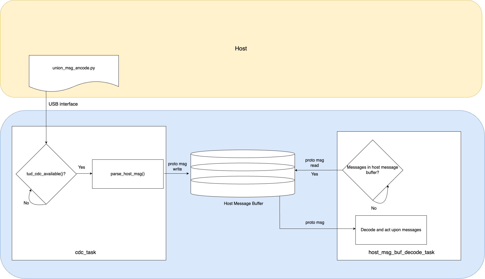

# Host to Raspberry Pi Pico W Command Interface with FreeRTOS, TinyUSB and nanopb

This C project showcases a robust serial communication system with USB between a host (such as a laptop running a pyserial script) and a Raspberry Pi Pico W, configured as a USB CDC (Communication Device Class) device. The Pico W is running FreeRTOS using TinyUSB as the usb stack and nanopb to decode and parse commands from the host. This project also demonstrates the use of Python as a host interface to encode commands sent to the Pico W.

## Description

To allow the host to interface with the Raspberry Pi Pico W via USB, commands are encoded/decoded using protobuf. Since protobuf is a streaming protocol, a custom delimiter (prepending each message with its message length) is used to extract each individual message before decoding using decode callbacks. This example also illustrates using decode callbacks in the context of `oneof` protobuf messages, which greatly enhances the flexibility of messages. The format of the mesesages exchanged is defined in `proto/unionproto.proto`. If you would like to modify the format, you can modify the `unionproto.proto` file, the cmake build system will then generate the necessary files in both C (for the device) and Python (for the host) to run this example. The configuration of this example is illustrated in the figure below.



## Technology utilised
### Hardware features
- [ ] Hardware timer interrupts

### Libraries
- [x] pico-sdk
- [x] FreeRTOS
- [ ] lwIP
- [x] TinyUSB
- [x] nanopb

### FreeRTOS features
- [x] Software timers
- [ ] Queues
- [ ] Semaphore/Mutexes
- [ ] Task notifications
- [x] Message buffers
- [ ] Stream buffers
- [ ] SMP

### Nanopb features
#### Encode
- [ ] Encode
- [ ] Encode strings
- [ ] Encode OneOf messages

#### Decode
- [x] Decode
- [x] Decode strings
- [x] Decode OneOf messages

## Getting Started

### Dependencies
The pico-sdk doesn't currently support using the FreeRTOS version of TinyUSB, hence custom modifications of the pico-sdk and TinyUSB repo is required for the CMAKE compile definitions to be passed down in order to extract the correct header files. The modifications below are required for using TinyUSB on FreeRTOS:
* Modify `CMakeLists.txt` of pico-sdk, with changes shown in https://github.com/raspberrypi/pico-sdk/pull/1438 (the next version of pico-sdk might well have this commit merged into main)
* Modify `family.cmake` in `pico-sdk/lib/tinyusb/hw/bsp/rp2040/family.cmake`. Comment out the line `CFG_TUSB_OS=OPT_OS_PICO` in `target_compile_definition(tinyusb_common_base ...)`

### Building and flashing the device code
Navigate to the root of this project `pico-4yp`, create a `build` directory using `mkdir build`. Then navigate into the `build` directory and run
```
cmake ..
```
Navigate into this project by
```
cd freertos/usb_nanopb_command_interface_no_lwip/
```
and run
```
make -j4
```
This will create the `elf` file which can be uploaded onto the Raspberry Pico W. To flash this file onto it directly with openocd, 
```
sudo openocd -f interface/cmsis-dap.cfg -f target/rp2040.cfg -c "adapter speed 5000" -c "program freertos_usb_nanopb_command_interface_no_lwip.elf verify reset exit"
```
Once it is uploaded successfully, we reset and should be able to see a TinyUSB device appearing with
```
ioreg -p IOUSB
```

### Executing host program
The host will be communicating with the USB CDC device through a Python script located in `python_host_script/union_msg_decode.py`. A serial connection is established and data is sent from the host to device. Don't forget to change the `port_name` in the Python script before executing it. It doesn't matter what the `baud_rate` is as USB will attempt to send the data as quick as possible. The script takes in a user input to select which message to send out of 3 messages. Once the messages is received by the Pico W, it will automatically decode the message and display its content via the default onboard UART ports.