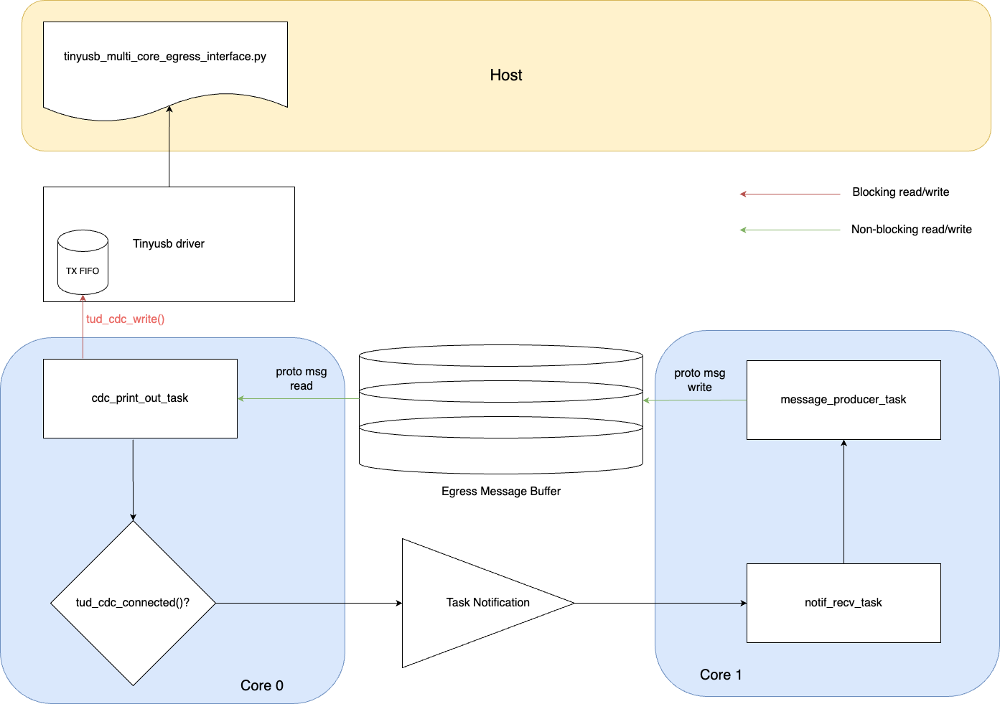

# Raspberry Pi Pico W Egress Interface with TinyUSB (Multi-core)

This C project investigates the performance of a data egress interface on the Raspberry Pi Pico W, with it being set up as a CDC (Communication Device Class) USB device to communicate with a host (such as a laptop running a pyserial script) using TinyUSB as the usb stack and nanopb for encoding/decoding messages. This project aims to measure the throughput of the data egress interface operating on FreeRTOS with TinyUSB as the usb stack, investigating the overhead of using nanopb to encode/decode real-time data. To investigate this, nanopb messages of varying sizes are being configured to send from the device to host, measuring the time taken as well as the delivery rate.  Note that the generation and sending of nanopb messages are split across 2 tasks, each task running on a core, hence it is multi-core egress interface.

## Description
When the Pico W is connected to a host and a serial terminal is being opened on the host (or executing the `python_host_scripts/tinyusb_multi_core_egress_interface.py` script), the Pico W will create the data, encode them into nanopb messages and send them to the host through TinyUSB. The setup of the test is illustrated in the figure below.



Core 0 on the RP2040 is responsible for communication with the host, and fetching nanopb messages from a FreeRTOS message buffer when messages are available to be sent across to the host. On the other hand, Core 1 is responsible for generating and encoding data into nanopb messages, and placing them onto the FreeRTOS message buffer.

To stress the system and allow us to work out what the bottleneck of the system is, a number of tests can be run by changing the messages to be sent (varying the size of message and message type, the message structure can be found in `proto/egress_multi_core.proto`).

## Technology utilised
### Hardware features
- [ ] Hardware timer interrupts

### Libraries
- [x] pico-sdk
- [x] FreeRTOS
- [ ] lwIP
- [x] TinyUSB
- [x] nanopb

### FreeRTOS features
- [ ] Software timers
- [ ] Queues
- [ ] Semaphore/Mutexes
- [x] Task notifications
- [x] Message buffers
- [ ] Stream buffers

## Getting Started

### Dependencies
The pico-sdk doesn't currently support using the FreeRTOS version of TinyUSB, hence custom modifications of the pico-sdk and TinyUSB repo is required for the CMAKE compile definitions to be passed down in order to extract the correct header files. The modifications below are required for using TinyUSB on FreeRTOS:
* Modify `CMakeLists.txt` of pico-sdk, with changes shown in https://github.com/raspberrypi/pico-sdk/pull/1438 (the next version of pico-sdk might well have this commit merged into main)
* Modify `family.cmake` in `pico-sdk/lib/tinyusb/hw/bsp/rp2040/family.cmake`. Comment out the line `CFG_TUSB_OS=OPT_OS_PICO` in `target_compile_definition(tinyusb_common_base ...)`

### Building and flashing the device code
Navigate to the root of this project `pico-4yp`, create a `build` directory using `mkdir build`. Then navigate into the `build` directory and run
```
cmake ..
```
Navigate into this project by
```
cd freertos/usb_device_tinyusb_egress_interface_no_lwip/
```
and run
```
make -j4
```
This will create the `elf` file which can be uploaded onto the Raspberry Pico W. To flash this file onto it directly with openocd, 
```
sudo openocd -f interface/cmsis-dap.cfg -f target/rp2040.cfg -c "adapter speed 5000" -c "program freertos_usb_device_tinyusb_egress_interface_no_lwip.elf verify reset exit"
```
Once it is uploaded successfully, we reset and should be able to see a TinyUSB device appearing with
```
ioreg -p IOUSB
```

### Executing host program
The host will be communicating with the USB CDC device through a Python script located in `python_host_script/tinyusb_egress_interface.py`. A serial connection is established and data is sent from the device to host. Don't forget to change the `port_name` in the Python script before executing it. It doesn't matter what the `baud_rate` is as USB will attempt to send/receive data as quick as possible. The script just outputs all the data received from the device without decoding, so streams of bytes will be displayed. The script will maintain the serial connection once the data has been transferred, users will have to exit the script manually through <kbd>Ctrl</kbd> + <kbd>c</kbd>. 